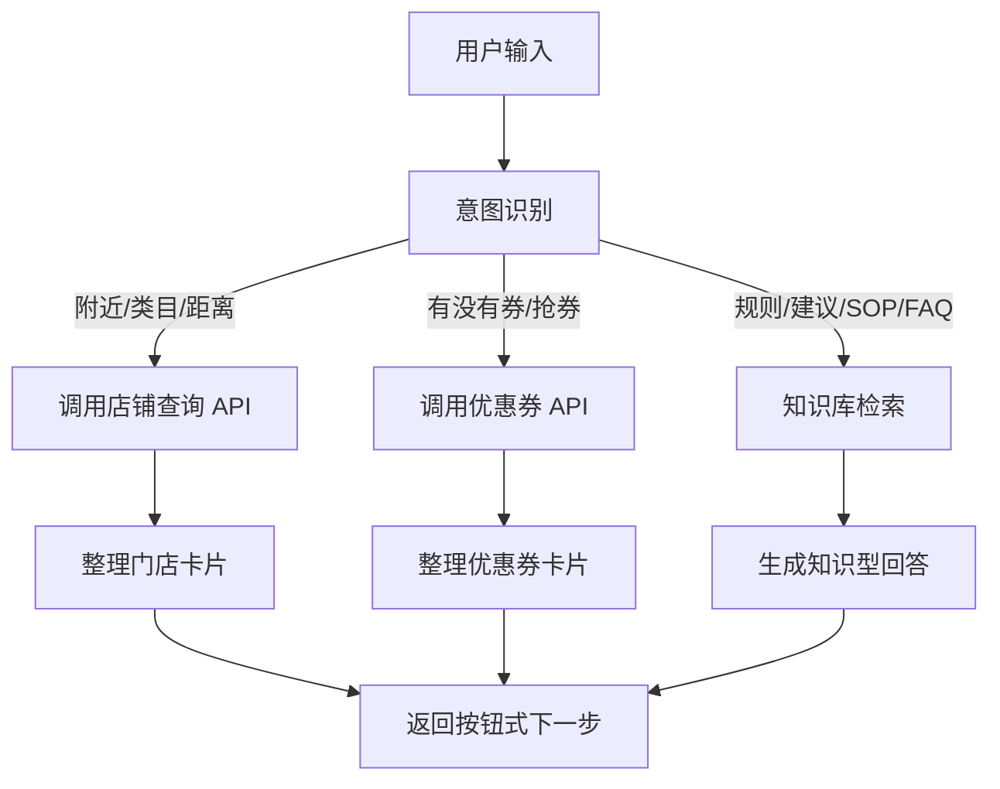

# 黑马点评 AI 导购助手设计

## 智能体定位

黑马点评 AI 导购助手是一个面向本地生活消费的对话式助手。它优先帮助用户更快找到附近合适门店、确认优惠券信息，并用知识库回答消费规则、类目选择、商家运营、客服口径等问题。

它不是闲聊机器人，也不是纯推荐系统。它的核心价值是：减少用户搜索成本，减少商家和平台客服成本。

## 三个功能优先级

### 1. 附近店铺查询

这是第一个必须完成的功能。用户进入首页后最常见的动作是按类目找店，例如截图中的美食、KTV、丽人美发、美睫美甲、按摩足疗、美容 SPA、亲子游乐、酒吧、密室、健身运动。

Agent 要做的事情：

- 理解用户想找的类目。
- 询问或获取用户位置。
- 调用后端附近店铺接口。
- 返回 3 到 5 家店，说明推荐原因。
- 给出下一步按钮：查优惠券、按距离排序、按评分排序、换一批。

优先调用后端 API，不从知识库猜测真实门店。

### 2. 优惠券助手

这是第二个必须完成的功能。用户选中店铺后，经常会问“有没有券”“哪张券最划算”“能不能抢秒杀券”。

Agent 要做的事情：

- 识别用户指定的门店或先让用户选店。
- 调用后端优惠券列表接口。
- 展示可用券、门槛、有效期、是否秒杀。
- 对秒杀券先做风险提醒，再让用户确认。
- 用户明确确认后，调用秒杀下单接口。

优惠券库存、是否过期、是否已购买必须以后端为准。

### 3. 知识库问答

这是第三个功能，专门解决不需要实时数据库的问题。

适合回答：

- 怎么选择附近店铺。
- 距离、人气、评分分别代表什么。
- 为什么有些店评分高但不一定适合我。
- 优惠券通用使用注意事项。
- 美食、KTV、丽人、美甲、按摩、亲子、酒吧等类目怎么选。
- 商家怎么提升页面转化。
- 商家怎么写活动说明，减少客服咨询。
- 平台客服如何统一回复。

不适合回答：

- 某家店当前是否营业。
- 某张券当前是否有库存。
- 用户是否买过某张券。
- 当前距离是多少。
- 后端数据库中的最新评分和评论数。

这些必须走后端 API。

## 智能体工作流

## 推荐意图分类

| 意图 | 例句 | 处理方式 |
|---|---|---|
| 附近店铺 | 附近有什么好吃的 | 后端 API |
| 类目筛选 | 找 KTV、找按摩 | 后端 API |
| 店铺搜索 | 搜索新白鹿 | 后端 API |
| 优惠券查询 | 这家店有没有券 | 后端 API |
| 秒杀券下单 | 帮我抢这张券 | 后端 API + 二次确认 |
| 消费建议 | 第一次约会怎么选餐厅 | 知识库 |
| 规则解释 | 团购券和秒杀券区别 | 知识库 |
| 商家运营 | 商家怎么提升转化 | 知识库 |
| 客服 FAQ | 券过期了怎么办 | 知识库 |

## 按钮式交互建议

首页欢迎语：

> 我可以帮你找附近店、查优惠券，也可以回答消费规则和商家运营问题。你想先做什么？

按钮：

- 附近美食
- 查店铺优惠券
- 帮我选一家店
- 优惠券怎么用
- 商家运营建议

门店结果按钮：

- 查这家优惠券
- 看同类附近店
- 按评分排序
- 按距离排序
- 换一批

优惠券结果按钮：

- 查看使用规则
- 领取普通券
- 秒杀这张券
- 换一家店

知识库回答按钮：

- 给我推荐门店
- 查优惠券
- 换成更便宜的方案
- 我是商家，给我 SOP

## 回答风格

回答要短、直接、能行动。不要长篇科普。每次回答最好包含：

1. 结论。
2. 2 到 4 个理由。
3. 下一步按钮或建议。

例如：

> 如果你只想快点吃上饭，优先看距离和营业时间；如果是约会或请客，优先看评分、评论数、人均和环境关键词。  
> 下一步可以点：附近高分美食、100 元以内、适合约会、查优惠券。

## 安全边界

- 不承诺真实库存，库存以后端为准。
- 不承诺真实营业状态，营业状态以后端或商家维护为准。
- 不直接编造某店优惠。
- 不给用户暴露数据库字段、SQL、Token、Redis Key。
- 秒杀券下单前必须二次确认。
- 对退款、投诉、食品安全等问题，给出平台处理流程，不替商家作最终承诺。
