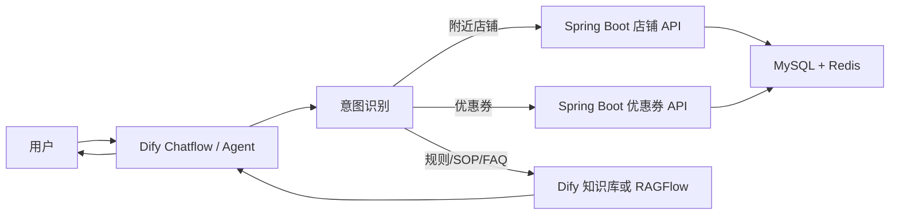

# Dify、RAGFlow 与黑马点评后端连接指南

本文说明如何把智能体落地成三个能力：

1. 附近店铺查询：调用黑马点评后端 API。
2. 优惠券助手：调用黑马点评后端 API。
3. 知识库问答：使用 Dify 知识库或 RAGFlow，不调用后端 API。

## 推荐架构



## 为什么 Dify 做主 Agent

你现在已经学了 Dify 和 RAGFlow。建议让 Dify 做主入口，因为：

- Dify 更适合做对话入口、按钮式流程和工具编排。
- Dify 可以直接导入 OpenAPI 工具，调用你的 Spring Boot。
- Dify 可以接自己的知识库，也可以通过 HTTP 调 RAGFlow。
- 后端不用知道用户是在网页、Dify 还是其他入口提问。

RAGFlow 更适合作为知识库检索引擎，不建议一开始把它也做成第二个主 Agent。主入口太多会让状态、权限、日志和调试变复杂。

## 第一步：创建 Dify 应用

推荐应用类型：Chatflow。

原因：

- 你的场景需要多轮交互。
- 用户可能先问附近店，再问某家店有没有券。
- 秒杀券需要二次确认。
- 知识库问答和工具调用需要分流。

## 第二步：导入知识库

在 Dify 中创建知识库，导入这些 Markdown 文件：

- `README.md`
- `00-agent-blueprint.md`
- `01-screen-and-user-flow.md`
- `02-shop-discovery-kb.md`
- `03-coupon-kb.md`
- `04-category-playbooks.md`
- `05-merchant-sop-kb.md`
- `06-customer-faq-kb.md`
- `07-rag-qa-seed.md`
- `dify-agent-system-prompt.md`

建议分段策略：

- Markdown 按标题切分。
- FAQ 文件可以用较小 chunk。
- SOP 文件可以用中等 chunk。
- 检索 top_k 建议从 3 到 5 开始。

## 第三步：导入后端工具

把 `hmdp-agent-tools.openapi.yaml` 导入 Dify Custom Tool。

需要替换：

```yaml
servers:
  - url: http://localhost:8081
```

如果 Dify 和 Spring Boot 在同一台机器上，可以保持本地地址；如果 Dify 在 Docker 中，`localhost` 通常指 Docker 容器自己，需要改成宿主机地址或服务名。

## 第四步：配置工具权限

无登录即可调用：

- `listShopTypes`
- `queryShopsByType`
- `searchShopsByName`
- `getShopById`
- `listVouchersByShop`

需要登录 Token：

- `seckillVoucher`

当前后端使用请求头：

```text
Authorization: 用户登录 token
```

所以 Dify 中秒杀工具要有一个变量保存用户 Token。如果只是项目演示，可以先不开放秒杀下单，只做查券和规则解释。

## 第五步：Chatflow 节点设计

### 节点 1：开始

输入变量：

- `query`：用户问题。
- `city`：默认杭州。
- `x`：经度，可选。
- `y`：纬度，可选。
- `token`：用户登录 token，可选。

### 节点 2：意图分类

分类：

- `nearby_shop`
- `coupon_query`
- `knowledge_qa`
- `seckill_action`
- `unknown`

分类提示：

> 如果用户问附近、类目、距离、评分、人均、搜索店名，归为 nearby_shop。  
> 如果用户问有没有券、哪张券划算、查优惠，归为 coupon_query。  
> 如果用户问规则、选择建议、商家运营、客服口径，归为 knowledge_qa。  
> 如果用户明确要求抢券、下单、秒杀，归为 seckill_action。

### 节点 3A：附近店铺

处理：

1. 识别类目。
2. 如果没有类目，先问用户想找什么。
3. 调用 `queryShopsByType` 或 `searchShopsByName`。
4. 返回店铺卡片。

按钮：

- 查第 1 家优惠券。
- 按评分排序。
- 人均 100 内。
- 换一批。

### 节点 3B：优惠券查询

处理：

1. 如果用户给了店名，先调用 `searchShopsByName` 找店。
2. 如果拿到 shopId，调用 `listVouchersByShop`。
3. 解释券类型和适合人群。

按钮：

- 查看规则。
- 领取普通券。
- 确认抢秒杀券。
- 换一家店。

### 节点 3C：知识库问答

处理：

1. 检索知识库。
2. 根据检索内容回答。
3. 不调用后端 API。

按钮：

- 帮我找附近门店。
- 查优惠券。
- 换个预算。
- 我是商家，给我 SOP。

### 节点 3D：秒杀动作

处理：

1. 检查是否有 Token。
2. 如果没有 Token，提示登录。
3. 如果用户还没有确认，先二次确认。
4. 用户确认后调用 `seckillVoucher`。

确认话术：

> 我可以帮你尝试抢这张秒杀券。请确认券名、门店、使用规则和一人一单限制。确认后我再提交。

## RAGFlow 接法

如果你决定使用 RAGFlow 做知识库：

1. 把 Markdown 文件导入 RAGFlow 数据集。
2. 在 RAGFlow 中调好切分、向量模型和检索参数。
3. 在 Dify 中用 HTTP Request 节点调用 RAGFlow 检索接口。
4. 把 RAGFlow 返回的片段传给 Dify 的 LLM 节点生成最终回答。

建议边界：

- RAGFlow 只负责召回知识。
- Dify 负责对话、工具调用、按钮、最终话术。
- Spring Boot 负责真实业务数据和写操作。

## 是否需要改 Nginx 前端

不需要改也能完成：

- Dify 发布独立 WebApp。
- 用户通过单独链接使用 Agent。
- 演示时可以和原黑马点评页面并排打开。

需要改前端的情况：

- 想在右侧放 AI 悬浮按钮。
- 想让用户点门店卡片后自动把 shopId 带给 Agent。
- 想在原页面内展示半屏 AI 抽屉。
- 想让底部导航增加“AI”入口。

最小改动方案：

- 只在 Nginx 增加 `/agent` 路由到 Dify 页面。
- 不改原页面业务代码。

体验最佳方案：

- 在 Vue/静态前端中加悬浮按钮。
- 点击后打开 iframe 或抽屉。
- 把当前页面上下文传入 Agent，例如类目、shopId、城市、经纬度。

## 开发优先级

第一阶段：

- Dify 独立页面。
- 导入知识库。
- 接店铺查询和优惠券查询两个工具。

第二阶段：

- 增加按钮式引导。
- 优化查券和找店的话术。
- 加入用户 Token，支持秒杀确认。

第三阶段：

- 前端悬浮按钮。
- 页面上下文传参。
- RAGFlow 替换或增强 Dify 知识库。

这个顺序最省力，也最适合当前黑马点评项目。
